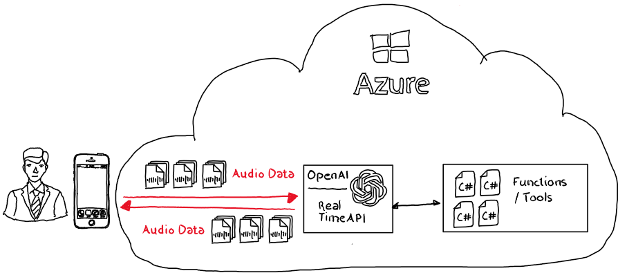

# OpenAI | Real Time API | Function Calling

## Introduction

### Real Time API

The Azure OpenAI Realtime API enables direct audio data transmission to the model instance, bypassing the need for pre-transcription or text synthesis steps.

The model processes incoming audio data natively, deriving insights and audio information without the need converting it into text by the caller.

Moreover, the API supports the inclusion of private or unavailable information while model creation through function calling, allowing for on-demand information retrieval. 

The model autonomously determines whether to invoke external functions or tools to enhance its processing capabilities, ensuring a seamless and contextually enriched experience.

## Repo Content

The repo showcases how tool or function calling can be used using the Azure OpenAI Real Time Interface using .NET and C#.

| Item | Description | Details |
|------| ----------- | ------- |
| [setup.azcli](./setup/setup.azcli) | Azure CLI Script to deploy the necessary Azure OpenAI instance and model instance | Use [MS PowerShell](https://learn.microsoft.com/de-de/powershell/scripting/install/installing-powershell) to execute the script |
| [config folder](./config/) | Folder containing an [env file](./config/config.env.template) | Rename the file to `config.env.template' to `config.env` and provide the necessary parameter if you already have an instance of Azure AI Speech. Execute [setup.azcli](./setup/setup.azcli) to create an instance of Azure AI Speech if not yet available. Pls take care to record and deploy the custom neural voice model using the [Azure AI Speech portal](https://speech.microsoft.com/portal/) |
| [RealTime_ToolCall.ipynb](./src/RealTime_ToolCall.ipynb) | Polyglot notebook with C# sample code highlighting tool/function calling | The sample answers the question "*Who won the Super Sports Event 2025*". Because it's a fictional sport event the model can't fulfill the task and needs to call a function/tool to provide a valid answer. |
